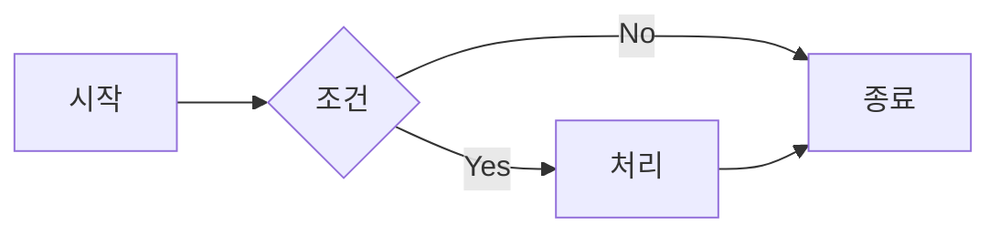

# Shortcodes 가이드

이 테마에서 마크다운 포스트 본문에 사용할 수 있는 shortcode 레퍼런스입니다.

Shortcode는 두 종류로 나뉩니다.

- **테마 공통 shortcode** — `index.js`에 등록되어 모든 블로그에서 사용 가능
- **블로그별 shortcode** — 각 블로그의 `.eleventy.js`에 등록되어 해당 블로그에서만 사용 가능

---

## 📋 목차

- [테마 공통 Shortcodes](#-테마-공통-shortcodes)
  - [alert (paired)](#alert-paired)
  - [comments](#comments)
  - [adsense](#adsense)
  - [image](#image)
  - [youtube](#youtube)
  - [cloudinary](#cloudinary)
  - [movie](#movie)
  - [person](#person)
  - [personInline](#personinline)
  - [button](#button)
- [블로그별 Shortcode 추가 방법](#-블로그별-shortcode-추가-방법)

---

## 🌐 테마 공통 Shortcodes

아래 shortcode들은 모두 테마의 `index.js`에 등록되어 있으며, 이 테마를 사용하는 **모든 블로그**에서 사용할 수 있습니다.

### `alert` (paired)

정보, 경고, 성공, 위험 등의 강조 박스를 표시합니다. 내부 콘텐츠에 마크다운을 사용할 수 있습니다.

**문법:**
```

내용 (마크다운 사용 가능)

```

**파라미터:**

| 파라미터 | 필수 | 기본값 | 설명 |
|---|---|---|---|
| `type` | 선택 | `info` | `info` / `success` / `warning` / `danger` |
| `제목` | 선택 | 타입별 기본 제목 | 박스 상단에 표시되는 제목 |

**예시:**

```

이것은 일반 정보입니다.



이 작업은 되돌릴 수 없습니다.



설치가 성공적으로 완료되었습니다.
**굵은 텍스트**와 `코드`도 사용 가능합니다.



프로덕션 데이터를 삭제합니다.

```

**타입별 기본 제목:**

| 타입 | 아이콘 | 기본 제목 |
|---|---|---|
| `info` | 💡 | 정보 |
| `success` | ✅ | 성공 |
| `warning` | ⚠️ | 주의 |
| `danger` | 🚨 | 경고 |

---

### `comments`

댓글 섹션을 삽입합니다. `post.njk` 레이아웃에 이미 포함되어 있으므로 일반적으로 직접 사용할 필요는 없습니다.

`.eleventy.js`의 `comments.provider` 옵션과 `site.json` / 환경 변수 설정에 따라 Utterances, Disqus, 또는 아무것도 표시하지 않습니다.

```

```

---

### `adsense`

Google AdSense 광고를 삽입합니다. `site.json` 또는 환경 변수에서 AdSense가 활성화된 경우에만 광고가 표시됩니다.

**문법:**
```

```

**파라미터:**

| 파라미터 | 필수 | 기본값 | 설명 |
|---|---|---|---|
| `type` | 선택 | `display` | `inArticle` / `display` |

**예시:**
```



```

- `inArticle`: 본문 중간에 삽입하는 인아티클 광고
- `display`: 일반 디스플레이 광고

---

### `image`

이미지를 최적화하여 삽입합니다 (WebP 변환, 반응형 srcset 자동 생성).

**문법:**
```

```

**예시:**
```

```

> 로컬 이미지 경로만 지원합니다. 외부 URL 이미지는 일반 마크다운 문법(``)을 사용하세요.

---

### `youtube`

YouTube 동영상을 반응형으로 삽입합니다. 전체 URL 또는 영상 ID를 모두 지원합니다.

**문법:**
```


```

**파라미터:**

| 파라미터 | 필수 | 기본값 | 설명 |
|---|---|---|---|
| `id_또는_url` | 필수 | — | YouTube 영상 ID 또는 전체 URL |
| `제목` | 선택 | `"YouTube video player"` | iframe의 title 속성 (접근성) |

**예시:**
```





```

16:9 비율로 렌더링되며, 모바일에서도 꽉 차게 표시됩니다.

---

### `cloudinary`

Cloudinary에 업로드된 이미지를 최적화하여 삽입합니다. LQIP(저화질 미리보기) 블러 효과와 반응형 srcset이 자동으로 적용됩니다.

**문법:**
```


```

**파라미터:**

| 파라미터 | 필수 | 기본값 | 설명 |
|---|---|---|---|
| `src` | 필수 | — | Cloudinary 전체 URL 또는 public ID |
| `alt` | 선택 | `""` | 이미지 대체 텍스트 (접근성, SEO) |
| `sizes` | 선택 | `"(max-width:720px) 100vw, 720px"` | 반응형 sizes 속성 |

**예시:**
```





```

- `f_auto`: 브라우저에 맞는 포맷 자동 선택 (WebP, AVIF 등)
- `q_auto`: 품질 자동 최적화
- `dpr_auto`: 디바이스 픽셀 비율 자동 대응
- 480, 768, 1024, 1365px 너비의 srcset 자동 생성

---

### `movie`

영화 정보 카드를 삽입합니다. OMDb API 키가 설정된 경우 IMDb 평점과 로튼 토마토 점수를 자동으로 가져옵니다.

**문법:**
```


```

**파라미터:**

| 파라미터 | 필수 | 기본값 | 설명 |
|---|---|---|---|
| `제목` | 필수 | — | 영화 제목 (API 실패 시 폴백으로 사용) |
| `imdbId` | 필수 | — | IMDb ID (예: `tt0111161`) |
| `posterUrl` | 선택 | OMDb API에서 자동 가져옴 | 포스터 이미지 URL |

**예시:**
```



```

OMDb API 키는 `src/_data/env.js`의 `omdbApiKey` 또는 `.env` 파일의 `OMDB_API_KEY`로 설정합니다. API 키가 없으면 평점 없이 제목과 포스터만 표시됩니다.

영화 데이터는 `.cache/movie-{imdbId}.json`에 7일간 캐시됩니다.

---

### `person`

인물 프로필 카드를 삽입합니다. 배우, 감독 등을 소개할 때 사용합니다.

**문법:**
```





```

**파라미터:**

| 파라미터 | 필수 | 기본값 | 설명 |
|---|---|---|---|
| `이름` | 필수 | — | 인물 이름 |
| `역할` | 선택 | `""` | 역할 또는 직책 (예: "감독", "주연") |
| `imageUrl` | 선택 | 플레이스홀더 이미지 | 프로필 이미지 URL |
| `profileUrl` | 선택 | `""` | 프로필 링크 URL |
| `imdbId` | 선택 | `""` | IMDb 인물 ID (예: `nm0000093`). `profileUrl`이 없을 때 IMDb 링크로 사용 |

**예시:**
```





```

---

### `personInline`

인물을 텍스트 흐름 안에 인라인으로 삽입합니다. 본문 중간에 인물을 언급할 때 사용합니다.

**문법:**
```




```

**파라미터:**

| 파라미터 | 필수 | 기본값 | 설명 |
|---|---|---|---|
| `이름` | 필수 | — | 인물 이름 |
| `imageUrl` | 선택 | 플레이스홀더 이미지 | 프로필 이미지 URL (작은 원형으로 표시) |
| `profileUrl` | 선택 | `""` | 프로필 링크 URL |
| `imdbId` | 선택 | `""` | IMDb 인물 ID |

**예시:**
```
이 영화는 가 감독했습니다.
```

`person`과 달리 블록 요소가 아닌 인라인 요소로 렌더링됩니다.

---

### `button`

스타일이 적용된 버튼 링크를 삽입합니다.

**문법:**
```


```

**파라미터:**

| 파라미터 | 필수 | 기본값 | 설명 |
|---|---|---|---|
| `텍스트` | 필수 | — | 버튼에 표시될 텍스트 |
| `url` | 필수 | — | 링크 URL |
| `variant` | 선택 | `accent` | `primary` / `accent` / `outline` |

**예시:**
```





```

**variant 스타일:**

| variant | 설명 |
|---|---|
| `accent` | 강조색 배경 (기본) |
| `primary` | 주색 배경 |
| `outline` | 테두리만 있는 투명 배경 |

외부 URL은 자동으로 `target="_blank" rel="noopener noreferrer"`가 적용됩니다.

---

## 🔧 블로그별 Shortcode 추가 방법

새 블로그에 커스텀 shortcode를 추가하려면 `.eleventy.js`에 등록합니다.

### 일반 shortcode

```javascript
module.exports = function (eleventyConfig) {
  const baseConfig = theme(eleventyConfig, { /* 옵션 */ });

  // 단순 shortcode
  eleventyConfig.addShortcode("badge", function(text, color = "blue") {
    return `<span class="badge badge-${color}">${text}</span>`;
  });

  return { ...baseConfig, dir: { ...baseConfig.dir, includes: "_includes", layouts: "_layouts" } };
};
```

마크다운에서 사용:
```


```

### Paired shortcode (내용을 감싸는 형태)

```javascript
eleventyConfig.addPairedShortcode("callout", function(content, title = "") {
  return `<div class="callout">
    ${title ? `<strong>${title}</strong>` : ""}
    ${content}
  </div>`;
});
```

마크다운에서 사용:
```

내용을 여기에 작성합니다.

```

### 비동기 shortcode (API 호출 등)

```javascript
eleventyConfig.addAsyncShortcode("github", async function(repo) {
  const res = await fetch(`https://api.github.com/repos/${repo}`);
  const data = await res.json();
  return `<a href="${data.html_url}">${data.full_name} ⭐ ${data.stargazers_count}</a>`;
});
```

마크다운에서 사용:
```

```

---

## 📌 Mermaid 다이어그램

Shortcode는 아니지만, 코드 블록 문법으로 다이어그램을 삽입할 수 있습니다.

````

````

빌드 시 자동으로 SVG로 변환됩니다. 지원하는 다이어그램 타입:

- `flowchart` / `graph` — 플로우차트
- `sequenceDiagram` — 시퀀스 다이어그램
- `classDiagram` — 클래스 다이어그램
- `timeline` — 타임라인
- `gitGraph` — Git 브랜치 그래프
- `pie` — 파이 차트

자세한 문법은 [Mermaid 공식 문서](https://mermaid.js.org/intro/)를 참고하세요.
